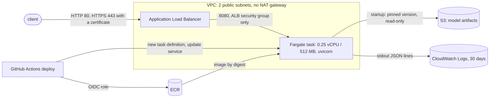

# World Cup 2026 forecaster

I wanted to see if I could predict soccer games better than the betting market, so I spent a
while this summer building this. It puts probabilities on every 2026 World Cup match (chance of
home win / draw / away win, plus full scorelines), simulates the whole tournament to get each
team's odds of winning the cup, and then grades itself against the bookies to see how close I
actually got.

Short version of what I found: I could not beat a good single model with a fancier single model,
but I *could* beat it by mixing two of them together. That surprised me and is the most
interesting part of the project.

> Heads up: the betting stuff is all paper-trading / just for measuring how good the predictions
> are. I'm not actually wagering money and there's no real-money anything in here.

## The results

Everything is scored "walk-forward" — I only ever let a model train on games that happened
*before* the match it's predicting, so it can't cheat by peeking at the answer. This is on
~8,000 real international games from 2018–2026. The number is RPS (lower = better; it's the
standard way to score ordered probability forecasts).

| model | RPS |
|---|---:|
| Elo (the simple baseline) | 0.1713 |
| Bayesian hierarchical Poisson | 0.1695 |
| LightGBM (gradient boosting) | 0.1705 |
| **Dixon–Coles** (best single model) | **0.1675** |
| **Blend of Dixon–Coles + LightGBM** | **0.1655** |

So the Bayesian model and the gradient-boosted model both *lost* to plain Dixon–Coles, which I
did not expect going in. But if you blend Dixon–Coles with the gradient-boosted model (about 2/3
to 1/3), the combo beats every single model on its own, and it holds up when I re-pick the blend
weights every six months and roll forward — not just on one lucky split. The gap is small
(~0.001 RPS) but it's real and it shows up in 6 of the last 7 years. Full breakdown, calibration
plots, and the live World-Cup scoreboard are in [RESULTS.md](RESULTS.md).

**And against the bookies?** That comparison only exists for the World Cup itself, because
that's the only stretch I have stored odds for (the ~8,000-game table above has no market
column). On the 101 of 104 World Cup matches that had a pre-kickoff line saved:

| forecaster | RPS (n = 101) |
|---|---:|
| market (de-vigged closing-line proxy) | 0.1501 |
| blend of Dixon–Coles + LightGBM | 0.1559 |
| Dixon–Coles | 0.1567 |
| LightGBM | 0.1602 |
| Elo | 0.1651 |

So the market scored better than every model, as expected. On 101 games the gap to the blend
(+0.006 RPS, 95% CI −0.005 to +0.016) is not statistically distinguishable from zero; Elo's gap
is. These numbers were computed on 2026-10-05 by `wc2026 export-artifact` and are stored in
[results/service_evaluation_2026-10-05.1.json](results/service_evaluation_2026-10-05.1.json),
which is also exactly what the API's `/models/comparison` endpoint returns.

## Stuff I learned the hard way

- **Combining models is where the edge is.** Each model on its own was fine; the win came from
  mixing them. The gradient-boosted model adds info the others can't see (recent form, rest days,
  travel) even though it's worse by itself.
- **The Bayesian model losing was a good lesson.** The whole pitch for partial pooling is that it
  helps teams with little data — but my Dixon–Coles model was already regularized, so the fancy
  prior didn't add much. I left the result in honestly instead of tuning until it "won."
- **Leakage is sneaky.** Getting the walk-forward right (including how I pick hyperparameters and
  blend weights) took more care than the models themselves.
- **Reading the actual rules matters.** The 2026 group tiebreakers use head-to-head *first* now,
  which is new, and the 8-of-12 third-place bracket is a real 495-row lookup table I had to parse
  out of FIFA's regulations and golden-test.

## What's in here

```
src/wc2026/
  data/         pulling + cleaning game data and odds, name matching, a little versioned store
  features/     match features the boosting model uses (form, rest, momentum) — all leak-free
  models/       elo · dixon_coles · bayes_poisson (PyMC) · gbm (LightGBM) · the blend
  tournament/   the real 2026 bracket + Annex C table, group tiebreakers, the Monte-Carlo sim
  eval/         scoring, calibration, the paired significance tests, market de-vigging, ensemble
  pipeline/     pull data → update models → re-simulate → regenerate the results
  dashboard/    a little FastAPI page that shows it all
  serving/      the prediction API: saved-model loading (local or S3), inference, JSON logs
infra/          AWS CDK (Python): ECR, ECS Fargate, load balancer, S3, CloudWatch, IAM
tools/          smoke.py and loadtest.py for a running service
```

Every model speaks the same interface, so the blend and the tournament simulator don't care which
one you hand them.

## Running it

```bash
make setup                                   # installs everything (uses uv + Python 3.12)
cp .env.example .env                         # add two free API keys if you want live data
make check                                   # lint + types + tests

uv run wc2026 simulate                       # win-the-cup table from 50k simulations
uv run wc2026 model-compare                  # the model-vs-model scoreboard + the blend
uv run wc2026 refresh                        # pull latest, rebuild everything
uv run wc2026 dashboard                      # http://127.0.0.1:8000
```

It's all seeded and reproducible, and there are 350+ tests (including a few property-based ones
and the golden test for the bracket) plus CI on every push.

## Things I'd flag honestly

- **The market is genuinely hard to beat.** The models did not beat it at the World Cup (table
  above). The market comparison covers one tournament, 101 matches; I don't have historical
  closing odds, so there is no market benchmark for the other ~8,000 games.
- International soccer is small-sample and noisy, so all the edges here are small.
- There's no player/injury/lineup data for national teams the way there is for clubs, so the
  models work at the team-strength level on purpose.
- The "closing" odds I compare against are snapshotted every 6 hours, so they can be a little
  stale, but the same way for every match.

## The prediction service

The blend is also available as a small HTTP API (`src/wc2026/serving/`). It loads one saved,
versioned model artifact at startup and answers from memory. It never trains or backtests.

**Status, stated plainly** (details and commands in [docs/verification.md](docs/verification.md)):

| Part | State |
|---|---|
| API, artifact export/loading, logging | Implemented and tested locally with a real artifact |
| Container image | Dockerfile written; **not yet built** (first CI run will build and smoke-test it) |
| GitHub Actions (CI + deploy) | Written and linted; **not yet run on GitHub** |
| AWS infrastructure (CDK) | Synthesizes, template assertions pass; **not deployed** |
| Live deployment / demo URL | **None yet** |

### What a prediction is (and isn't)

`POST /predict` returns home-win / draw / away-win probabilities for one international fixture:
0.67 × Dixon–Coles + 0.33 × LightGBM, the same blend evaluated above.

- Team strength and form are **frozen at the artifact's training cutoff**. There is no live data
  feed: results, injuries and line-ups after the cutoff are unknown to the model.
- Only `date`, `neutral` and `competition` vary per request. Dates before the cutoff or more than
  180 days after it are rejected (180 days is the refit cadence the evaluation used, so the
  service is never staler than what was scored).
- These are 90-minute result probabilities for team-level models with small edges. Paper
  analysis only; nothing here places bets.

### Run it locally

```bash
make setup

# Option A: no data needed. A SYNTHETIC test artifact (five invented teams).
make fixture-artifact
make serve                                         # http://127.0.0.1:8080/docs
make smoke

# Option B: a real artifact (about 15 minutes; needs the data, see "Model artifacts").
uv run wc2026 export-artifact --version 2026-10-05.1
make serve ARTIFACT=artifacts/2026-10-05.1
```

```bash
curl -s -X POST http://127.0.0.1:8080/predict -H 'content-type: application/json' \
  -d '{"home_team": "brazil", "away_team": "morocco", "date": "2026-10-10", "neutral": true, "competition": "friendly"}'
```

```json
{
  "fixture": {"home_team": "brazil", "away_team": "morocco", "date": "2026-10-10", "neutral": true, "competition": "friendly"},
  "probabilities": {"home_win": 0.5031, "draw": 0.2930, "away_win": 0.2039},
  "components": {
    "dixon_coles": {"home_win": 0.5284, "draw": 0.2920, "away_win": 0.1795},
    "gbm": {"home_win": 0.4516, "draw": 0.2951, "away_win": 0.2533}
  },
  "blend_weights": {"dixon_coles": 0.67, "gbm": 0.33},
  "model": {"artifact_version": "2026-10-05.1", "training_cutoff": "2026-08-27", "max_prediction_date": "2027-02-23", "feature_schema_version": "1", "synthetic": false},
  "request_id": "…"
}
```

(Real output from artifact `2026-10-05.1`, rounded to 4 places here. With the synthetic artifact
use teams `alpha`…`echo` and a date in 2020-01-01…2020-06-29; every response then says
`"synthetic": true`.)

| Route | Purpose |
|---|---|
| `POST /predict` | One fixture → blended probabilities, component models, artifact version |
| `GET /teams` | Team ids the loaded model supports |
| `GET /models/comparison` | The stored evaluation: walk-forward model results, and separately models vs the closing-odds baseline. `503 evaluation_unavailable` if the artifact has none; numbers are never generated on request |
| `GET /health` | Liveness: the process answers |
| `GET /ready` | Readiness: a validated artifact is in memory (in-process check, no S3 call). `503` otherwise |
| `GET /docs` | OpenAPI docs with examples |

Errors always look like `{"error": {"code", "message", "details"?}, "request_id"}`:
`validation_error`, `unknown_team`, `unsupported_date` (422), `payload_too_large` (413, bodies
over 16 KB), `model_unavailable` / `evaluation_unavailable` (503), `internal_error` (500, no
internal detail in the body; the traceback is in the logs under the same `request_id`).

### Model artifacts

Training and evaluation are offline commands. The service only reads their output.

```bash
# 1. data: history is public; World Cup fixtures/odds live on this repo's `data` branch
git fetch origin data && git worktree add data origin/data
uv run wc2026 ingest-history

# 2. train + evaluate + write artifacts/<version>/  (never overwrites a version)
uv run wc2026 export-artifact --version 2026-10-05.1

# 3. publish to S3 (validates first; refuses to overwrite; manifest uploaded last)
uv run wc2026 upload-artifact --bundle artifacts/2026-10-05.1 --bucket <ArtifactBucket>
```

A bundle is five files: `manifest.json` (artifact version, training cutoff, last supported date,
feature-schema version, library versions, SHA-256 and size of every file), `dixon_coles.json`,
`gbm.txt` (LightGBM's text format), `team_state.json`, and `evaluation.json`. Nothing is pickled,
so loading cannot execute code. The hashes catch corruption and partial uploads; they do not make
an untrusted publisher safe, so only load bundles you exported, from a bucket you control.

At export time the bundle is reloaded through the serving code and its predictions are compared
with the in-memory pipeline on probe fixtures; a mismatch fails the export. The exported bundle is
not committed (the artifact directory is gitignored) and the match data is never uploaded.

| Variable | Meaning |
|---|---|
| `WC2026_ARTIFACT_SOURCE` | `local` (default) or `s3` |
| `WC2026_ARTIFACT_DIR` | local: bundle directory |
| `WC2026_ARTIFACT_BUCKET`, `WC2026_ARTIFACT_PREFIX` | s3: bucket and key prefix (default `artifacts`) |
| `WC2026_ARTIFACT_VERSION` | s3: **required**, the pinned version. local: optional check |
| `WC2026_ARTIFACT_LOAD_TIMEOUT_S` | s3: startup download budget, default 60 |
| `WC2026_ARTIFACT_CACHE_DIR` | s3: download location, default `/tmp/wc2026-artifacts` |
| `WC2026_MAX_BODY_BYTES`, `WC2026_LOG_LEVEL` | request-size bound (16384), log level (`INFO`) |

S3 access uses the standard AWS credential chain (the task role on ECS). No credential is read
from code, baked into the image, or needed for local development.

**Startup and failure behaviour.** The artifact is loaded once, before the server accepts
connections. S3 calls have 3 s connect / 10 s read timeouts and at most 3 attempts, inside the
overall budget above. If loading fails the process stays up, `/health` is 200, `/ready` and
`/predict` are 503 with a reason code, and the log has an `artifact_load_failed` line. It does not
retry by itself; on ECS the failing `/ready` check replaces the task.

**Concurrency.** One uvicorn worker. Handlers are synchronous and run in the server's thread pool,
so inference never blocks the event loop. A second worker would load a second copy of the model
(about 245 MB resident per process, measured) for no benefit on a 0.25-vCPU task.

### Docker

```bash
docker build --platform linux/amd64 -t wc2026-api .
docker run --rm -p 8080:8080 \
  -v "$PWD/artifacts/synthetic-fixture:/artifact:ro" -e WC2026_ARTIFACT_DIR=/artifact wc2026-api
python3 tools/smoke.py http://127.0.0.1:8080
```

Python 3.12 slim, dependencies installed from `uv.lock` (`serve` extra only: no training stack or
dev tools), non-root user (uid 10001), port 8080, `linux/amd64` to match the ECS task. The build
context is an allow-list (`pyproject.toml`, `uv.lock`, `README.md`, `src/`), so data, artifacts,
`.env` and `.git` cannot end up in the image.

### Tests and CI

`make check` runs lint, mypy and the tests. The API tests use the synthetic artifact and a stubbed
S3 client, so nothing needs AWS. `.github/workflows/ci.yml` runs three jobs on every pull request,
none of which use credentials or secrets:

1. **lint, types, tests**: the full suite, including API and infrastructure-template tests.
2. **container build + smoke**: builds the image, checks it runs as non-root, runs
   `tools/smoke.py` against it, checks a container with no artifact is alive but not ready.
3. **infrastructure synth**: `cdk synth` with no AWS access.

The slow historical evaluations (`export-artifact`, `model-compare`, `bayes-compare`) are not part
of CI. To make CI binding, enable branch protection on `main` and require those three checks
(Settings → Branches). That setting is not enabled by this repository's code.

### AWS architecture



One CDK stack (`infra/`). Choices worth knowing:

- **Networking.** Public subnets only. The task has a public IP so it can reach ECR, S3 and
  CloudWatch without a NAT gateway or VPC endpoints, but its security group accepts traffic only
  from the load balancer. This is a low-cost demo layout, not a hardened one; private subnets with
  endpoints or NAT would be the next step.
- **HTTP only by default.** Without `-c certificate_arn=…` the endpoint is plain HTTP on the
  load balancer's DNS name: a demo endpoint, not production-ready. With a certificate you get
  HTTPS and an HTTP→HTTPS redirect.
- **One task, no autoscaling, no high availability.** A deployment starts a second task before
  stopping the first, and that is all.
- **No authentication and no rate limiting.** Anyone with the URL can call it.
- **Roles are separate**: execution role (pull image, write logs), application role (read
  `artifacts/*` in the bucket), deploy role (push to this ECR repo, register task definitions,
  update this service), assumable only by this repository's `production` environment via OIDC.

Deploying, GitHub settings, logs, rollback, teardown and cost drivers are in
**[docs/deployment.md](docs/deployment.md)**. Short version:

```bash
cd infra
uv run --group infra npx aws-cdk@2.1144.0 bootstrap        # once per account/region
uv run --group infra npx aws-cdk@2.1144.0 deploy -c artifact_version=2026-10-05.1   # 0 tasks
uv run wc2026 upload-artifact --bundle ../artifacts/2026-10-05.1 --bucket <ArtifactBucket>
# set the stack outputs as variables on the GitHub `production` environment, then:
# Actions → deploy → Run workflow   (builds, pushes, rolls out 1 task, smoke-checks, rolls back on failure)
```

Ongoing cost drivers: the load balancer (hourly, the largest fixed cost), the Fargate task, three
public IPv4 addresses, CloudWatch log ingestion, ECR and S3 storage. `cdk destroy` removes
everything except the artifact bucket.

### Logs

One JSON line per request on stdout (CloudWatch on ECS): `request_id`, `method`, `route`,
`status`, `duration_ms`, `artifact_version`, and `error_code` / traceback on failures. Bodies and
headers are never logged. Startup writes `artifact_load_start` then `artifact_loaded` or
`artifact_load_failed`. These are logs, not metrics; latency and error rates come from querying
them (queries in the deployment doc) or from `tools/loadtest.py`.

### Measured performance (local only)

`python3 tools/loadtest.py http://127.0.0.1:8080 --concurrency 8 --duration 30`, 2026-10-05, real
artifact `2026-10-05.1`, one worker, service and load generator sharing one 2-vCPU sandbox VM:
12,319 requests in 30 s after a 5 s warm-up (90% `/predict`, 10% `/ready`), 0 errors, p50 19 ms,
p95 26 ms. This says nothing about the 0.25-vCPU Fargate task, which has not been measured.

### Known limitations and open work

- Nothing is deployed; the container build and both workflows have not run yet.
- The model is as old as its training cutoff; refreshing means exporting and deploying a new
  artifact version by hand.
- `matplotlib` and `pyarrow` are base dependencies of the package, so they are in the image though
  the service does not use them.
- The Bayesian model is not in the artifact evaluation (hours of MCMC); see `results/`.
- `RESULTS.md` was generated on 2026-06-13 and its live table is stale (1 match with a line);
  `wc2026 report` regenerates it.

## License

MIT — do whatever you want with it.
