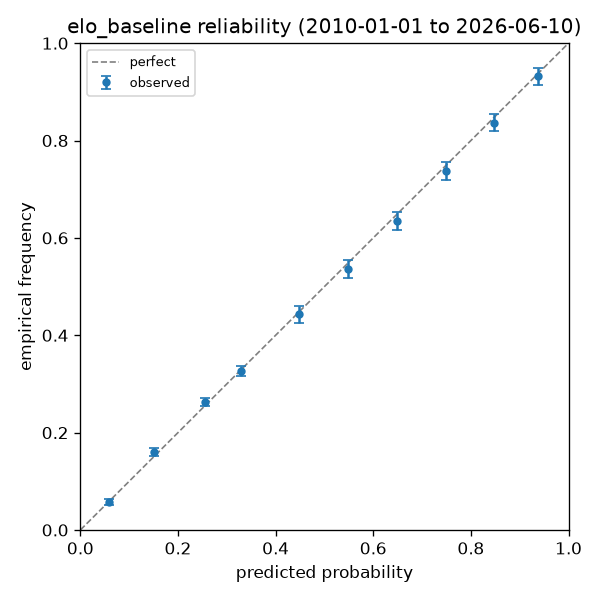
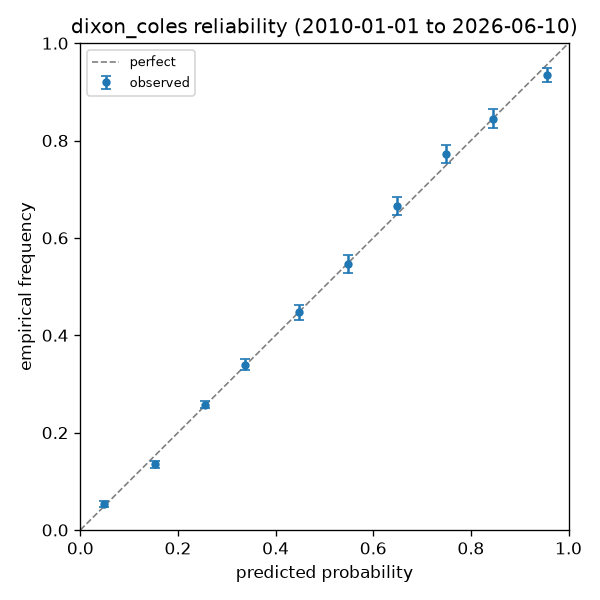

# RESULTS — live scoreboard

_Generated 2026-06-13 02:06 UTC. Lower is better on every metric; RPS is primary. `ece` = expected calibration error. CIs are 95% bootstrap._

## Track A — PRIMARY: historical walk-forward (real sample size)

All internationals, 2010-01-01 → 2026-06-10; every prediction fit strictly on
pre-cutoff matches (ratings AND the ordinal link). No market column here:
historical closing odds are paywalled on the free tier, so the market is
only benchmarked on the live track below.

| model | n | rps | rps_ci_lo | rps_ci_hi | log_loss | brier | ece |
|---|---|---|---|---|---|---|---|
| elo_baseline | 15816 | 0.1749 | 0.1725 | 0.1774 | 0.8886 | 0.5232 | 0.0068 |
| dixon_coles | 15816 | 0.1711 | 0.1687 | 0.1735 | 0.8742 | 0.5130 | 0.0072 |

- dixon_coles: decay half-life (1460d) and L2 shrinkage (0.25) selected JOINTLY by walk-forward RPS on an inner 2004-2009 validation window (training always pre-cutoff), frozen and committed before the 2010+ test window was evaluated — full table in results/dc_tuning.md; rho and the neutral listed-home coefficient fitted by MLE. Reproduce with `wc2026 tune-dc`.

### Tournament-only slice (World Cup + continental finals)

| model | n | rps | rps_ci_lo | rps_ci_hi | log_loss | brier | ece |
|---|---|---|---|---|---|---|---|
| elo_baseline | 1442 | 0.1853 | 0.1782 | 0.1927 | 0.9416 | 0.5591 | 0.0088 |
| dixon_coles | 1442 | 0.1828 | 0.1758 | 0.1901 | 0.9308 | 0.5524 | 0.0127 |

## Track B — LIVE: World Cup 2026 (SMALL SAMPLE — no conclusions yet)

Accumulates match by match as the tournament runs. The market column is
the de-vigged closing-line proxy (sharpest book; see README). With the
current sample size this table is reported for transparency only —
**do not read anything into it yet.**

| model | n | rps | rps_ci_lo | rps_ci_hi | log_loss | brier | ece |
|---|---|---|---|---|---|---|---|
| elo_baseline (all completed) | 3 | 0.1635 | 0.0161 | 0.3009 | 0.9457 | 0.5999 | 0.3196 |
| dixon_coles (all completed) | 3 | 0.1613 | 0.0826 | 0.2261 | 0.9156 | 0.5538 | 0.2644 |

- Live model rows cover all 3 completed WC matches; market rows exist only where a pre-kickoff quote was stored (collection began 2026-06-12): 0 matches so far.
- Model-vs-market gaps are quantified on their COMMON matches as they accumulate; the baseline is expected to lose to the market — that gap is the target for Dixon-Coles and the Bayesian model.
